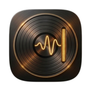
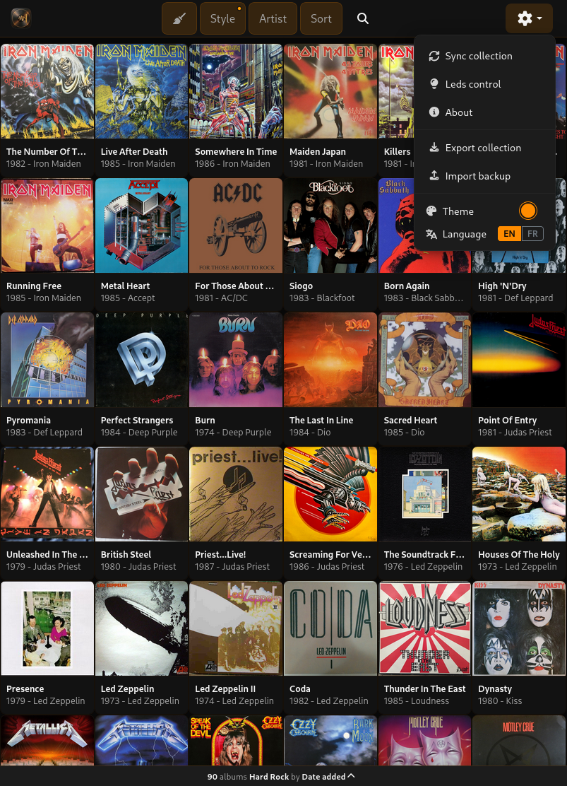
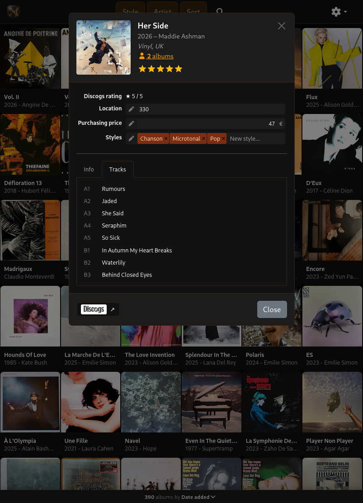
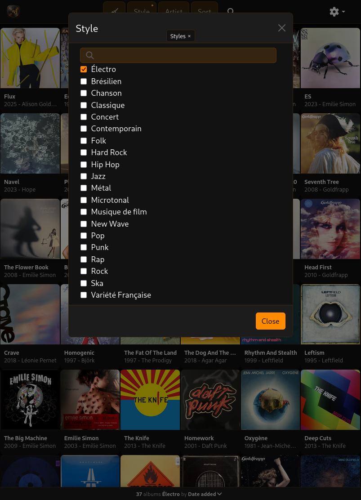
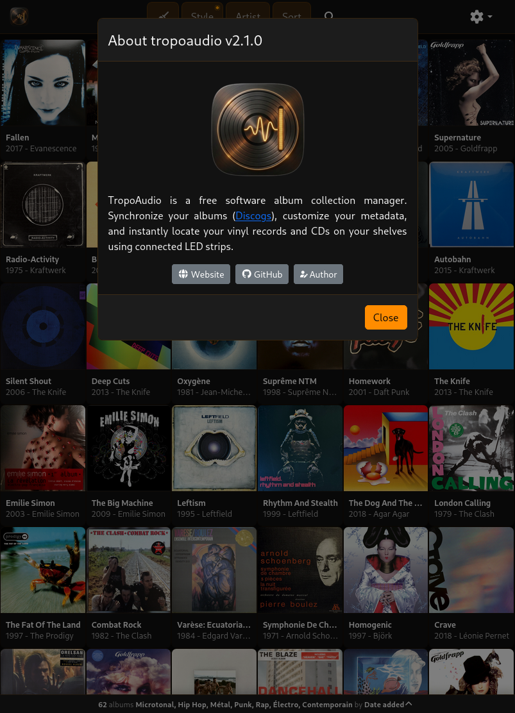

# TropoAudio

[](../../LICENSE) [](https://www.discogs.com/developers/) [](https://reactjs.org/) [](https://vitejs.dev/)

**TropoAudio is a free software album collection manager, part of the [TropoAtlas](../../README.md) suite. Synchronize your albums (Discogs), customize your metadata, and instantly locate your vinyl records and CDs on your shelves using connected LED strips.**

_TropoAudio is the direct successor to the original [TropoDisc repository](https://github.com/esaracco/tropodisc), which has been archived and remains available for historical reference._

<div align="center"></div>

---

## Features

- 🔎 **Instant Search & Multi-criteria Filter**: Browse and filter your collection in real-time by artist, style/category, media format, year, rating, or physical shelf location.
- 🏷️ **Custom Metadata**: Enrich album entries with custom fields: exact shelf position, purchase price, and custom styles.
- 💡 **Physical LED Shelf Locator & Ruler**: Select an album, styles, or artists, and the corresponding slots on your shelf light up instantly via connected LED strips. Includes a dedicated physical ruler mode to illuminate whole shelves.
- 📦 **Backup & Complete Collection Export**:
  - **Quick Export**: Exports all cached metadata and album covers into a portable ZIP archive.
  - **Full Extraction & Enrichment**: Proactively fetches missing album details and high-resolution cover artwork.
- 📥 **Offline Import & Restore**: Restore or migrate your collection on another device by importing the ZIP backup without needing an internet connection.
- 📱 **Progressive Web App (PWA)**: Full offline navigation support and responsive touch interface optimized for desktop, tablet, and mobile.
- 🎨 **Multi-Theme Support**: Dark, Light, Orange, Blue, Purple, and Green themes with instant zero-flicker hydration.

---

## Screenshots






---

## Requirements

- A Discogs account (or compatible future data provider)
- Node.js 18+
- NPM (Workspaces supported)

---

## Configuration

Copy the sample environment file into your application directory:

```bash
cp .env.sample .env
```

### Core Environment Variables

| Variable                       | Description                                                                       | Default      |
| :----------------------------- | :-------------------------------------------------------------------------------- | :----------- |
| `VITE_DATA_PROVIDER`           | Active data provider plugin                                                       | `"discogs"`  |
| `VITE_CURRENCY`                | Currency symbol displayed for prices                                              | `€`          |
| `VITE_DISCOGS_USER`            | Your Discogs username                                                             | _(Required)_ |
| `DISCOGS_TOKEN`                | Your Discogs personal API token _(No `VITE_` prefix to prevent browser exposure)_ | _(Required)_ |
| `VITE_DISCOGS_FORMATS`         | Media formats to include (e.g. `vinyl`, `cd`, `all`)                              | `all`        |
| `VITE_DISCOGS_FIELDS_REQUIRED` | Only show items that have at least one custom field (`yes`/`no`)                  | `no`         |

### Custom Fields (Discogs)

TropoAudio automatically reads and maps the following optional custom fields created in your Discogs collection:

- **`place`**: Physical shelf location (numeric value if LEDs are enabled).
- **`price`**: Purchase price.
- **`categories`**: Custom album style tags (comma-separated).

### LED Strips Configuration

- **`VITE_SET_LEDS`**: Set to `"yes"` to enable IoT LED communication.
- **`VITE_LED_TARGET`**: HTTP URL of your microcontroller LED server (e.g., `http://192.168.1.1`).
- **`VITE_LEDS_CREATORS_COLOR`**: RGB color for artists filter layer (default: `0,0,130`).
- **`VITE_LEDS_CATEGORIES_COLOR`**: RGB color for styles filter layer (default: `0,150,0`).
- **`VITE_LEDS_WORK_COLOR`**: RGB color for focused album modal (default: `255,0,0`).

> 💡 **Hardware Setup & Wiring**:
> To assemble, flash, and connect your physical shelf LED controller, see the [ESP32 LED Controller Firmware Guide](../../firmware/led-controller/README.md) and the [Official Wiring Diagram (SVG)](../../firmware/led-controller/wiring-diagram.svg).

---

## Development

From the repository root:

```bash
# Start TropoAudio development server
npm run dev -w apps/tropoaudio

# Or start directly with the root shortcut:
npm run dev:audio
```

Open `http://localhost:3000` in your browser.

---

## Production Deployment

TropoAudio is purely static in production: API requests are securely proxied through your web server (Apache or Nginx) to inject your secret Discogs token on the fly without exposing it to the browser.

### Option 1: Docker (Recommended)

Build and run the production container from the repository root:

```bash
# Build the Docker image
docker build --build-arg APP_NAME=tropoaudio --build-arg PORT=3000 -t tropoaudio:prod .

# Run the container
docker run --rm -it -p 3000:3000 -e DISCOGS_TOKEN="your_personal_token" tropoaudio:prod
```

### Option 2: Apache Reverse Proxy

1. Enable required modules:

```bash
sudo a2enmod headers rewrite proxy proxy_http ssl
sudo systemctl restart apache2
```

2. Build the production bundle from the repository root:

```bash
npm run build:audio
```

_(Generates static assets in `apps/tropoaudio/build`, along with `.htaccess` and `headers.conf`)._

3. Configure Apache VirtualHost:

```apache
<VirtualHost *:443>
    ServerName disques.yourdomain.com
    DocumentRoot /var/www/tropoatlas/apps/tropoaudio/build

    SSLProxyEngine On

    # Static files and .htaccess support
    <Directory /var/www/tropoatlas/apps/tropoaudio/build>
        Options Indexes FollowSymLinks
        AllowOverride All
        Require all granted
    </Directory>

    # Secure Discogs API Proxy (Token Injection)
    <Location /api/discogs/>
        RequestHeader set Authorization "Discogs token=YOUR_SECRET_TOKEN"
        IncludeOptional /var/www/tropoatlas/apps/tropoaudio/build/headers.conf
        ProxyPreserveHost Off
        ProxyPass https://api.discogs.com/
        ProxyPassReverse https://api.discogs.com/
    </Location>

    # Discogs Artwork Image Proxy (CORS bypass for client-side ZIP export)
    <Location /api/discogs-image/>
        IncludeOptional /var/www/tropoatlas/apps/tropoaudio/build/headers.conf
        Header set Access-Control-Allow-Origin "*"
        ProxyPreserveHost Off
        ProxyPass https://i.discogs.com/
        ProxyPassReverse https://i.discogs.com/
    </Location>

    # (Optional) LED Server Proxy
    <Location /api/leds>
        ProxyPass http://192.168.1.1/leds
        ProxyPassReverse http://192.168.1.1/leds
    </Location>
    <Location /api/ruler>
        ProxyPass http://192.168.1.1/ruler
        ProxyPassReverse http://192.168.1.1/ruler
    </Location>
    <Location /api/ping>
        ProxyPass http://192.168.1.1/ping
        ProxyPassReverse http://192.168.1.1/ping
    </Location>
</VirtualHost>
```

4. Reload Apache:

```bash
sudo systemctl reload apache2
```

---

## Static Presentation Site

The static presentation site for TropoAudio is located in `apps/tropoaudio/docs/` and available online at [https://tropoaudio.esaracco.fr](https://tropoaudio.esaracco.fr).

---

## License

TropoAudio is part of the [TropoAtlas](../../README.md) project and is released under the GNU GPL v3 License. See [LICENSE](../../LICENSE) for details.
