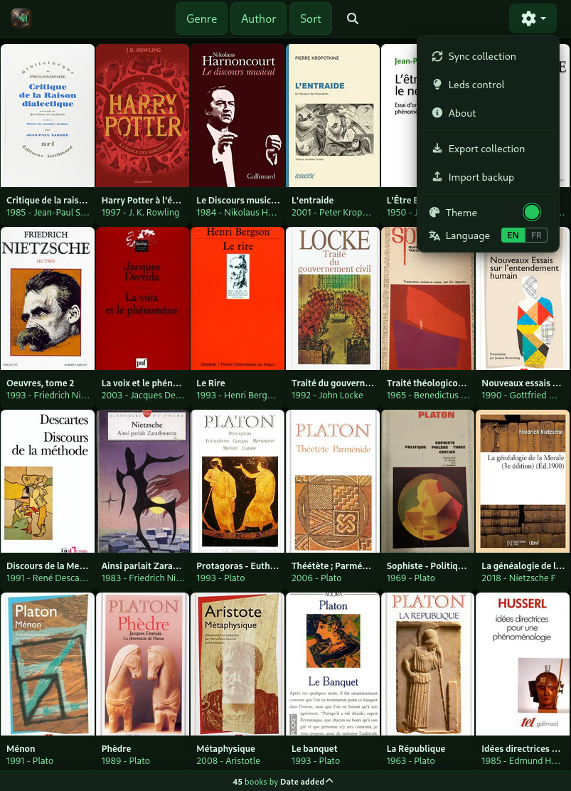
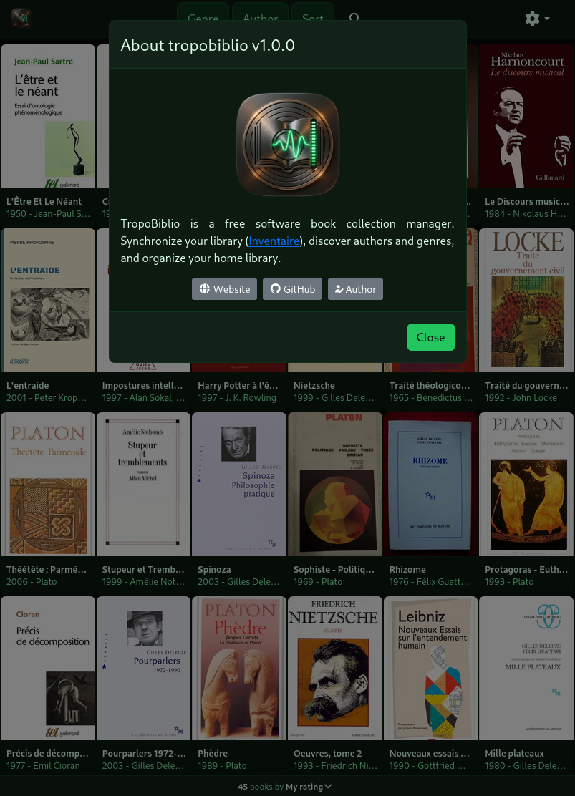

# TropoBiblio

[](../../LICENSE) [](https://inventaire.io/) [](https://reactjs.org/) [](https://vitejs.dev/)

**TropoBiblio is a free software book collection manager, part of the [TropoAtlas](../../README.md) suite. Synchronize your books from [Inventaire.io](https://inventaire.io/), customize your metadata, enrich entries with open knowledge (Wikipedia, Open Library, Wikidata), and instantly locate your books on your shelves using connected LED strips.**

<div align="center"></div>

---

## Features

- 🔎 **Instant Search & Multi-criteria Filter**: Browse and filter your book collection in real-time by author, genre, format/publisher, publication year, rating, or physical shelf location.
- 🏷️ **Custom Metadata & Private Notes**: Extract custom fields from your Inventaire.io private notes: exact shelf location (`place`), purchase price (`price`), personal rating (`rating`), and custom genres (`genre`).
- 📚 **Automatic Enrichment & Open Knowledge**: Enriches book descriptions and synopses with summaries from Wikipedia, Open Library, and Wikidata with smart disambiguation.
- 💡 **Physical LED Shelf Locator & Ruler**: Select a book, genres, or authors, and the corresponding slots on your shelf light up instantly via connected LED strips. Includes a dedicated physical ruler mode to illuminate whole shelves.
- 📦 **Backup & Complete Collection Export**:
  - **Quick Export**: Exports all cached metadata and book covers into a portable ZIP archive.
  - **Full Extraction & Enrichment**: Proactively fetches missing book details and high-resolution cover artwork.
- 📥 **Offline Import & Restore**: Restore or migrate your collection on another device by importing the ZIP backup without needing an internet connection.
- 📱 **Progressive Web App (PWA)**: Full offline navigation support and responsive touch interface optimized for desktop, tablet, and mobile.
- 🎨 **Multi-Theme Support**: Dark, Light, Orange, Blue, Purple, and Green (default) themes with instant zero-flicker hydration.

---

## Screenshots






---

## Requirements

- An [Inventaire.io](https://inventaire.io/) account
- Node.js 18+
- NPM (Workspaces supported)

---

## Configuration

Copy the sample environment file into your application directory:

```bash
cp .env.sample .env
```

### Core Environment Variables

| Variable                   | Description                                                                | Default        |
| :------------------------- | :------------------------------------------------------------------------- | :------------- |
| `VITE_DATA_PROVIDER`       | Active data provider plugin (determines required provider variables below) | `"inventaire"` |
| `VITE_CURRENCY`            | Currency symbol displayed for prices                                       | `€`            |
| `VITE_INVENTAIRE_USER`     | Your Inventaire.io username or email                                       | _(Required)_   |
| `VITE_INVENTAIRE_PASSWORD` | Your Inventaire.io password (required to access private notes)             | _(Optional)_   |

### Private Notes Custom Fields (Inventaire)

TropoBiblio extracts custom metadata from tags defined in your Inventaire private notes (format: `#tag value` or `tag: value`):

- **`place`**: Physical shelf location (numeric value for LEDs).
- **`price`**: Purchase price.
- **`rating`**: Personal rating (1 to 5).
- **`categories`**: Custom genre tags (comma or slash separated).

### LED Strips Configuration

- **`VITE_SET_LEDS`**: Set to `"yes"` to enable IoT LED communication.
- **`VITE_LED_TARGET`**: HTTP URL of your microcontroller LED server (e.g., `http://192.168.1.1`).
- **`VITE_LEDS_CREATORS_COLOR`**: RGB color for authors filter layer (default: `0,0,130`).
- **`VITE_LEDS_CATEGORIES_COLOR`**: RGB color for genres filter layer (default: `0,150,0`).
- **`VITE_LEDS_WORK_COLOR`**: RGB color for focused book modal (default: `255,0,0`).

> 💡 **Hardware Setup & Wiring**:
> To assemble, flash, and connect your physical shelf LED controller, see the [ESP32 LED Controller Firmware Guide](../../firmware/led-controller/README.md) and the [Official Wiring Diagram (SVG)](../../firmware/led-controller/wiring-diagram.svg).

---

## Development

From the repository root:

```bash
# Start TropoBiblio development server
npm run dev -w apps/tropobiblio

# Or start directly with the root shortcut:
npm run dev:biblio
```

Open `http://localhost:3002` in your browser.

---

## Production Deployment

TropoBiblio builds as a static Single Page Application in production. API calls and image requests to Inventaire.io are proxied through your web server (Apache or Nginx).

### Option 1: Docker (Recommended)

Build and run using Docker Compose or standalone Docker from the repository root:

```bash
# Using Docker Compose (automatically builds with apps/tropobiblio/.env)
docker compose up tropobiblio

# Or using standalone Docker (ensure apps/tropobiblio/.env is configured before build)
docker build --build-arg APP_NAME=tropobiblio --build-arg PORT=3002 -t tropobiblio:prod .
docker run --rm -it -p 3002:3002 tropobiblio:prod
```

> **Configuration Note**: Unlike Discogs or TMDB where secret API tokens (`DISCOGS_TOKEN`, `TMDB_TOKEN`) are injected at runtime via reverse proxy headers, Inventaire authentication is handled directly by the frontend application. Therefore, `VITE_INVENTAIRE_USER` and `VITE_INVENTAIRE_PASSWORD` are compiled into the static bundle and must be configured in `apps/tropobiblio/.env` before building the Docker image.

### Option 2: Apache Reverse Proxy

1. Enable required modules:

```bash
sudo a2enmod headers rewrite proxy proxy_http ssl
sudo systemctl restart apache2
```

2. Build the production bundle from the repository root:

```bash
npm run build:biblio
```

_(Generates static assets in `apps/tropobiblio/build`, along with `.htaccess` and `headers.conf`)._

3. Configure Apache VirtualHost:

```apache
<VirtualHost *:443>
    ServerName livres.yourdomain.com
    DocumentRoot /var/www/tropoatlas/apps/tropobiblio/build

    SSLProxyEngine On

    # Static files and .htaccess support
    <Directory /var/www/tropoatlas/apps/tropobiblio/build>
        Options Indexes FollowSymLinks
        AllowOverride All
        Require all granted
    </Directory>

    # Inventaire.io API Proxy
    <Location /api/inventaire/>
        IncludeOptional /var/www/tropoatlas/apps/tropobiblio/build/headers.conf
        ProxyPreserveHost Off
        ProxyPass https://inventaire.io/api/
        ProxyPassReverse https://inventaire.io/api/
    </Location>

    # Inventaire.io Artwork Image Proxy (CORS bypass for client-side ZIP export)
    <Location /api/inventaire-image/>
        IncludeOptional /var/www/tropoatlas/apps/tropobiblio/build/headers.conf
        Header set Access-Control-Allow-Origin "*"
        ProxyPreserveHost Off
        ProxyPass https://inventaire.io/
        ProxyPassReverse https://inventaire.io/
    </Location>

    # (Optional) LED Server Proxy
    <Location /api/leds>
        ProxyPass http://192.168.1.1/leds
        ProxyPassReverse http://192.168.1.1/leds
    </Location>
    <Location /api/ruler>
        ProxyPass http://192.168.1.1/ruler
        ProxyPassReverse http://192.168.1.1/ruler
    </Location>
    <Location /api/ping>
        ProxyPass http://192.168.1.1/ping
        ProxyPassReverse http://192.168.1.1/ping
    </Location>
</VirtualHost>
```

4. Reload Apache:

```bash
sudo systemctl reload apache2
```

---

## Static Presentation Site

The static presentation site for TropoBiblio is located in `apps/tropobiblio/docs/` and available online at [https://tropobiblio.esaracco.fr](https://tropobiblio.esaracco.fr).

---

## License

TropoBiblio is part of the [TropoAtlas](../../README.md) project and is released under the GNU GPL v3 License. See [LICENSE](../../LICENSE) for details.
