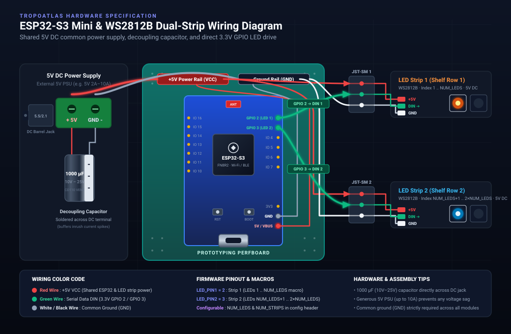

# TropoAtlas LED Controller

Firmware for the **ESP32-S3 Mini** used by **TropoAtlas** to control addressable LED strips.

Once flashed, the board connects to your Wi-Fi network and exposes a simple HTTP API on port **80**. The TropoAudio web application (in TropoAtlas) uses this API to illuminate the LEDs corresponding to the physical location of an album in your collection.

---

## Features

- ESP32-S3 Mini compatible
- HTTP REST API
- Control one or more LEDs
- RGB color support
- Optional incremental updates without resetting previous LEDs
- Designed for TropoAtlas, but can be used independently

---

## Requirements

### Hardware

- **ESP32-S3 Mini** microcontroller board (3.3V logic)
- **WS2812B** (or compatible) 5V addressable RGB LED strips
- **5V DC power supply** (5V 2A to 10A; a generous 10A supply provides ample headroom and prevents voltage drops across long strips)
- **DC barrel jack to screw terminal adapter** (5.5 / 2.1 mm)
- **1000 µF (10V–25V) electrolytic capacitor** (soldered directly across DC screw terminals to buffer inrush current spikes)
- **2× 3-pin JST-SM connectors** (quick disconnects for shelf strips)
- **Prototyping perfboard**

---

## Hardware & Wiring Guide

The controller drives **two independent LED strips** (one per shelf row) powered by a shared **5V DC** supply. A **1000 µF capacitor** is wired in parallel across the incoming DC power terminals to absorb inrush currents when LEDs illuminate.

[](./wiring-diagram.svg)

> 🔌 _Click the diagram above to open or download the [full-resolution vector schematic (SVG)](./wiring-diagram.svg)._

### Pinout & Wire Color Coding

| Component | Pin / Signal | Connected To | Wire Color | Notes |
| :--- | :--- | :--- | :--- | :--- |
| **5V DC In** | `+5V` | ESP32 `5V/VBUS`, Strip 1 `+5V`, Strip 2 `+5V` | **Red** | Common 5V VCC power rail |
| **5V DC In** | `GND` | ESP32 `GND`, Strip 1 `GND`, Strip 2 `GND` | **Black / White** | Mandatory shared ground |
| **Capacitor** | `+ / -` | Screw terminal `+5V` & `GND` | Soldered leads | 1000 µF (10V–25V) buffer |
| **ESP32** | `GPIO 2` | Strip 1 `DIN` (JST-SM 1) | **Green** | Direct 3.3V data drive (`LED_PIN1`) |
| **ESP32** | `GPIO 3` | Strip 2 `DIN` (JST-SM 2) | **Green** | Direct 3.3V data drive (`LED_PIN2`) |
| **Strip 1** | `1 .. NUM_LEDS` | Upper shelf row | JST-SM (3-pin) | Configurable via `NUM_LEDS` macro |
| **Strip 2** | `NUM_LEDS+1 .. 2×NUM_LEDS` | Lower shelf row | JST-SM (3-pin) | Configurable via `NUM_LEDS` macro |

### Arduino IDE

Install the following packages before compiling:

#### Boards

- ESP32 by Espressif

#### Libraries

- FastLED
- ArduinoJson
- WiFi
- WebServer

---

## Configuration

Before uploading the firmware, configure the hardware macros and Wi-Fi credentials in `led-controller.ino`:

```cpp
#define LED_PIN1 2
#define LED_PIN2 3

#define NUM_LEDS 200    // Number of LEDs per strip (adjust to shelf width)
#define NUM_STRIPS 2    // Number of independent strips

#define WIFI_SSID "********"
#define WIFI_PASSWORD "********"
```

Compile and upload the project to your ESP32.

Once started, the board will listen for HTTP requests on port **80**.

---

# HTTP API

## Turn on LEDs

```
POST /leds
```

### Payload

The endpoint expects a form parameter named `data` containing a **JSON array** of LED command objects. If the array is empty (`[]`), all LEDs are turned off.

#### JSON Object Properties

| Property    | Required | Description                                                    |
| ----------- | -------- | -------------------------------------------------------------- |
| `leds`      | ✅       | Comma-separated list of LED indices (e.g., `"1,30,500"`).      |
| `color`     | ✅       | RGB color as `"R,G,B"` (0–255).                                |
| `intensity` | No       | Float (0.0 to 1.0) to dynamically scale the brightness.        |
| `blink`     | No       | `true` to apply a blinking animation (toggles every 500ms).    |
| `noreset`   | No       | `true` to preserve the current LEDs before applying the new ones. |

### Example

Send a `POST` request (e.g., `application/x-www-form-urlencoded`) with the `data` parameter:

```
data=[{"leds":"1,30,500","color":"50,25,200","intensity":0.4,"blink":true}]
```

Turns on LEDs **1**, **30** and **500** using the RGB color `(50,25,200)` scaled down to 40% brightness, and applies a blinking animation.

To clear all LEDs, send an empty array:

```
data=[]
```

---

## Reset LEDs

```
GET /ruler
```

### Parameters

| Parameter | Required | Description                 |
| --------- | -------- | --------------------------- |
| `reset`   | No       | If set, turns all LEDs off. |

### Example

```
GET /ruler?reset=1
```

---

## Example workflow

```
TropoAudio
      │
      │ HTTP
      ▼
ESP32-S3 Mini
      │
      ▼
WS2812 LED strips
      │
      ▼
Highlighted album location
```

---

## License

This firmware is part of the **TropoAtlas** project and is distributed under the GNU GPL v3 License.
